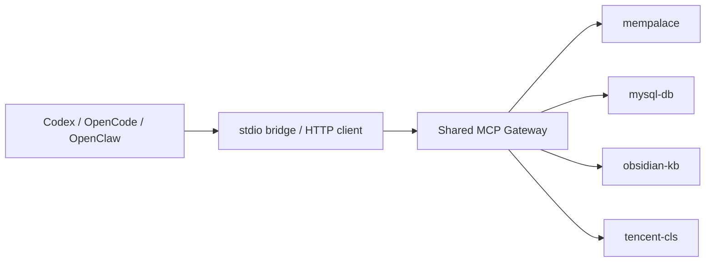

# Shared MCP Gateway

Shared MCP Gateway aggregates multiple reusable MCP servers behind one HTTP MCP endpoint, so Codex, OpenCode, Claude Code, OpenClaw, and similar clients can share the same tool layer.

## What problem this project solves

When multiple AI clients each connect to multiple MCP servers independently, teams usually run into the same issues:

- Every client needs its own MCP configuration.
- The same MCP stack drifts across clients over time.
- Troubleshooting becomes fragmented across different runtimes and logs.
- Adding or replacing a shared MCP server requires changing multiple places.

This project solves that by introducing a single shared gateway layer:

- One registry for downstream MCP definitions.
- One HTTP MCP endpoint for clients.
- One place for health checks, logs, failure isolation, and lightweight circuit breaking.
- One script to render client-side config snippets.

## What it can do

Current capabilities include:

- Aggregating multiple stdio-based downstream MCP servers.
- Re-exposing tools with `namespace.tool_name` naming.
- Tagging requests with a `caller` identity for traceability.
- Providing `/healthz` for health and circuit-breaker visibility.
- Emitting structured `logfmt` logs for grep / CLS / Loki style systems.
- Isolating unhealthy downstream servers so one failure does not degrade the whole gateway.
- Rendering config snippets for Codex, OpenCode, and OpenClaw.
- Running connectivity and safe tool checks through `scripts/self_check.py`.

## Project structure

```text
shared-mcp-gateway/
├── Dockerfile
├── docker-compose.yml
├── registry.toml
├── registry.compose.toml
├── README.md
├── README.en.md
├── docs/
├── generated/
├── templates/
├── scripts/
└── shared_mcp_gateway/
```

## How it works



## Quick start

### 1. Install dependencies

```bash
cd /path/to/shared-mcp-gateway
python3 -m venv .venv
source .venv/bin/activate
pip install -r requirements.txt
```

### 2. Prepare configuration files

You can start from the provided templates:

- `templates/registry.template.toml`
- `templates/registry.compose.template.toml`
- `templates/docker-compose.template.yml`

Example:

```bash
cp templates/registry.template.toml registry.local.toml
cp templates/registry.compose.template.toml registry.compose.local.toml
cp templates/docker-compose.template.yml docker-compose.local.yml
```

### 3. Run locally

```bash
python3 shared_mcp_gateway/gateway.py --registry registry.toml --log-level INFO
```

Default endpoints:

- MCP endpoint: `http://127.0.0.1:8787/mcp`
- Health endpoint: `http://127.0.0.1:8787/healthz`

### 4. Run with Docker Compose

```bash
docker compose up -d --build
docker compose ps
curl http://127.0.0.1:8787/healthz
```

Stop it with:

```bash
docker compose down
```

## Configuration guide

The registry files are the central configuration for this project.

### 1. Listen settings

```toml
[listen]
host = "127.0.0.1"
port = 8787
path = "/mcp"
```

### 2. Gateway metadata

```toml
[gateway]
name = "shared-gateway"
namespace_separator = "."
description = "Shared MCP gateway for local development."
```

### 3. Downstream MCP server definition

```toml
[[servers]]
key = "mysql-db"
enabled = true
namespace = "mysql_db"
command = "/bin/bash"
args = ["-lc", "cd /opt/mcps/mysql-connector && ./.venv/bin/python server.py"]
```

Optional `env` can be provided per downstream server.

### 4. Local exceptions (optional)

```toml
[local_exceptions.some-client]
keep_local = ["host-only-mcp"]
reason = "Example: one MCP must stay bound to a single host."
endpoint = "http://127.0.0.1:8090/mcp"
```

### 5. Client config path metadata (optional)

```toml
[clients.codex]
config_path = "~/.codex/config.toml"
```

These `clients.*` sections are metadata only. The project does not automatically overwrite those files. The recommended workflow is to generate config snippets first and then copy them manually.

## Configuration examples

### Host-run example

Use `registry.toml` for a direct host setup.

### Containerized example

Use `registry.compose.toml` when the gateway runs inside Docker / Compose and downstream paths are mounted inside the container.

If you want the Dockerized gateway to host `OpenSpace` as well, make sure you:

- install OpenSpace Python dependencies in the image
- mount the OpenSpace source tree into `/workspace/OpenSpace`
- pass LLM / OpenSpace API credentials into the container environment
- add `openspace` to `[[servers]]` in `registry.compose.toml`

## Configuration template files

This repository already includes copy-friendly templates:

- `templates/registry.template.toml`
- `templates/registry.compose.template.toml`
- `templates/docker-compose.template.yml`

## Client integration examples

Recommended workflow:

1. Start the gateway and verify `/healthz`.
2. Run `python3 scripts/render_client_configs.py`.
3. Copy the generated files from `generated/` into your client config.

### Codex

Use `generated/codex-mcp.toml` when possible. The generated structure looks like this:

```toml
[mcp_servers.shared-gateway]
command = "/bin/bash"
args = ["-lc", "python3 /absolute/path/to/shared_mcp_gateway/stdio_bridge.py --url http://127.0.0.1:8787/mcp --caller codex"]
enabled = true
```

### OpenCode

Use `generated/opencode-mcp.jsonc` when possible:

```json
{
  "$schema": "https://opencode.ai/config.json",
  "mcp": {
    "shared-gateway": {
      "type": "local",
      "enabled": true,
      "command": [
        "/bin/bash",
        "-lc",
        "python3 /absolute/path/to/shared_mcp_gateway/stdio_bridge.py --url http://127.0.0.1:8787/mcp --caller opencode"
      ]
    }
  }
}
```

### OpenClaw

OpenClaw can connect directly to the HTTP MCP endpoint:

```json
{
  "mcpServers": {
    "shared-gateway": {
      "url": "http://127.0.0.1:8787/mcp",
      "transport": "streamable-http",
      "connectionTimeoutMs": 10000,
      "disabled": false
    }
  }
}
```

### Claude Code

The gateway already supports `caller=claude-code` through `stdio_bridge.py`. The core command is:

```bash
python3 /absolute/path/to/shared_mcp_gateway/stdio_bridge.py --url http://127.0.0.1:8787/mcp --caller claude-code
```

If your Claude Code setup supports custom local stdio MCP commands, you can reuse this bridge command directly.

## Common commands

### Render client configs

```bash
python3 scripts/render_client_configs.py
```

### Run health checks

```bash
python3 scripts/self_check.py
python3 scripts/self_check.py --json
```

### View logs

```bash
docker compose logs -f shared-mcp-gateway
```

## Current shared MCPs

- `mempalace`
- `mysql-db`
- `obsidian-kb`
- `tencent-cls`

See also: `/path/to/shared-mcp-gateway/docs/mcp-topology.md`
