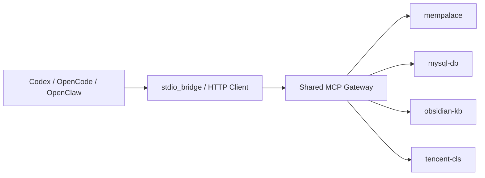

# Shared MCP Gateway

统一把多个共享型 MCP Server 收口到一个 HTTP 网关里，对外提供一套稳定、可观测、可复用的 MCP 接入层，方便 Codex、OpenCode、Claude Code、OpenClaw 等客户端共同使用。

## 项目解决了什么问题

在多客户端、多 MCP Server 并行使用的场景下，通常会遇到这些问题：

- 每个客户端都要单独维护一套 MCP 配置，重复劳动多。
- 同一个工具链在不同客户端里配置不一致，容易出现“这个客户端能用、那个客户端不能用”。
- 下游 MCP Server 一旦异常，排查入口分散，不方便统一日志、自检和熔断处理。
- 新增或替换一个 MCP Server 时，需要分别改多份配置，变更成本高。

`shared-mcp-gateway` 的目标，就是把这些共享型能力统一纳管：

- **一处维护注册表**：通过 `registry.toml` / `registry.compose.toml` 统一维护下游 MCP。
- **一处对外暴露能力**：通过一个 HTTP MCP 端点聚合多个下游服务。
- **一处做运维治理**：统一健康检查、结构化日志、失败隔离、最小熔断。
- **一处生成客户端配置**：自动产出 Codex / OpenCode / OpenClaw 的接入配置片段。

## 项目能干什么

当前项目已经支持：

- 聚合多个基于 stdio 的下游 MCP Server。
- 把下游工具按 `namespace.tool_name` 方式统一暴露。
- 为不同客户端自动打上 `caller` 标识，方便日志追踪。
- 提供 `/healthz` 健康检查接口，查看已连接服务、失败服务、熔断状态。
- 提供结构化 `logfmt` 日志，便于 grep、CLS、Loki 等系统检索。
- 在下游异常时做最小隔离，避免单个 MCP Server 挂掉影响整体体验。
- 生成客户端配置文件：
  - Codex：`generated/codex-mcp.toml`
  - OpenCode：`generated/opencode-mcp.jsonc`
  - OpenClaw：`generated/openclaw-mcp.json`
- 通过 `scripts/self_check.py` 进行连通性、自检工具、关键能力探活。

## 适用场景

适合以下场景直接使用：

- 同一套 MCP 能力需要被多个 AI 客户端复用。
- 希望把“共享能力”与“宿主本地特例能力”分层治理。
- 希望统一日志、自检、健康检查与故障隔离。
- 希望新增一个共享 MCP 时，只改一份注册表配置。

## 项目结构

```text
shared-mcp-gateway/
├── Dockerfile                          # 网关镜像构建文件
├── docker-compose.yml                  # 当前本地落地用 Compose 编排
├── registry.toml                       # 宿主机直跑配置
├── registry.compose.toml               # 容器内运行配置
├── requirements.txt                    # Python 依赖
├── docs/
│   └── mcp-topology.md                 # 哪些 MCP 进入网关、哪些保留本地特例
├── generated/                          # 自动生成的客户端配置文件
├── scripts/
│   ├── render_client_configs.py        # 生成客户端配置片段
│   └── self_check.py                   # 健康检查与关键工具自检
├── shared_mcp_gateway/
│   ├── config.py                       # 注册表解析
│   ├── gateway.py                      # HTTP MCP 聚合网关主程序
│   ├── logging_utils.py                # 结构化日志输出
│   ├── render.py                       # 客户端配置渲染
│   └── stdio_bridge.py                 # stdio 客户端到 HTTP MCP 的桥接
└── templates/
    ├── docker-compose.template.yml     # Compose 配置模板
    └── registry.template.toml          # 注册表模板
```

## 核心工作方式



## 快速开始

### 1. 安装依赖

```bash
cd /Users/jervis.jiang/jervis.jiang/shared-mcp-gateway
python3 -m venv .venv
source .venv/bin/activate
pip install -r requirements.txt
```

### 2. 准备配置

你可以直接参考模板文件：

- `templates/registry.template.toml`
- `templates/docker-compose.template.yml`

最常见的做法是：

```bash
cp templates/registry.template.toml registry.local.toml
cp templates/docker-compose.template.yml docker-compose.local.yml
```

然后把模板里的路径、端口、下游服务命令替换成你自己的实际环境。

### 3. 本地直接启动

```bash
python3 shared_mcp_gateway/gateway.py --registry registry.toml --log-level INFO
```

启动后默认访问：

- MCP 端点：`http://127.0.0.1:8787/mcp`
- 健康检查：`http://127.0.0.1:8787/healthz`

### 4. Docker Compose 启动

```bash
docker compose up -d --build
docker compose ps
curl http://127.0.0.1:8787/healthz
```

停止：

```bash
docker compose down
```

## 如何配置：核心配置说明

项目的核心配置文件是 `registry.toml`，主要包含四部分：

### 1. 监听配置

```toml
[listen]
host = "127.0.0.1"
port = 8787
path = "/mcp"
```

含义：

- `host`：网关监听地址
- `port`：网关监听端口
- `path`：MCP HTTP 路径

### 2. 网关元信息

```toml
[gateway]
name = "shared-gateway"
namespace_separator = "."
description = "Shared MCP gateway for Codex, OpenCode and OpenClaw."
```

含义：

- `name`：对外暴露的网关名称
- `namespace_separator`：命名空间分隔符，默认通常使用 `.`
- `description`：网关描述信息

### 3. 下游 MCP Server 配置

```toml
[[servers]]
key = "mysql-db"
enabled = true
namespace = "mysql_db"
command = "/bin/bash"
args = ["-lc", "cd /opt/mcps/mysql-connector && ./.venv/bin/python server.py"]
```

含义：

- `key`：下游服务唯一标识
- `enabled`：是否启用
- `namespace`：工具名前缀命名空间
- `command`：启动命令
- `args`：启动参数
- `env`：可选，给该服务单独注入环境变量

### 4. 本地特例说明

```toml
[local_exceptions.openclaw]
keep_local = ["openspace"]
reason = "OpenSpace 强依赖宿主上下文，保留本地直连。"
endpoint = "http://127.0.0.1:8081/mcp"
```

用于记录哪些能力不走共享网关，而是继续保留本地直连。

## 如何配置：案例

### 案例 1：宿主机直跑配置

下面是一个可直接参考的最小示例：

```toml
[listen]
host = "127.0.0.1"
port = 8787
path = "/mcp"

[gateway]
name = "shared-gateway"
namespace_separator = "."
description = "Shared MCP gateway for local development."

[[servers]]
key = "mempalace"
enabled = true
namespace = "mempalace"
command = "/opt/mempalace/.venv/bin/python"
args = ["-m", "mempalace.mcp_server"]
env = { PYTHONPATH = "/opt/mempalace" }

[[servers]]
key = "mysql-db"
enabled = true
namespace = "mysql_db"
command = "/bin/bash"
args = ["-lc", "cd /opt/mcps/mysql-connector && ./.venv/bin/python server.py"]

[local_exceptions.shared_gateway]
managed = ["mempalace", "mysql_db"]
reason = "共享能力统一由 shared-gateway 纳管。"
```

### 案例 2：Docker Compose 配置思路

如果你希望容器内统一运行网关，可参考下面的思路：

```yaml
services:
  shared-mcp-gateway:
    build:
      context: .
      dockerfile: Dockerfile
    container_name: shared-mcp-gateway
    restart: unless-stopped
    ports:
      - "127.0.0.1:8787:8787"
    environment:
      OBSIDIAN_VAULT_PATH: /workspace/openclaw-workspace
      PYTHONPATH: /workspace/mempalace
    volumes:
      - /opt/mcps:/workspace/mcps:ro
      - /opt/mempalace:/workspace/mempalace:ro
      - /opt/openclaw-workspace:/workspace/openclaw-workspace:rw
      - /opt/mempalace-data:/root/.mempalace:rw
```

适合：

- 把多个 MCP 运行时依赖挂进同一个容器上下文。
- 通过只读挂载保证下游代码目录稳定。
- 统一使用容器里的 `registry.compose.toml`。

## 配置模板文件

为了便于直接落地，项目已经补充了可复制的模板文件：

### 1. 注册表模板

文件：`templates/registry.template.toml`

用途：

- 新环境初始化时，直接复制一份改路径即可。
- 适合作为宿主机直跑的起点配置。
- 保留了 `listen`、`gateway`、`servers`、`clients`、`local_exceptions` 的完整结构。

建议使用方式：

```bash
cp templates/registry.template.toml registry.local.toml
```

### 2. Compose 模板

文件：`templates/docker-compose.template.yml`

用途：

- 新机器或新环境快速准备 Compose 编排。
- 避免直接修改现网或当前机器专用的 `docker-compose.yml`。
- 便于把挂载路径、环境变量改成团队自己的规范。

建议使用方式：

```bash
cp templates/docker-compose.template.yml docker-compose.local.yml
```

## 常用命令

### 生成客户端配置

```bash
python3 scripts/render_client_configs.py
```

生成结果位于：

- `generated/codex-mcp.toml`
- `generated/opencode-mcp.jsonc`
- `generated/openclaw-mcp.json`

### 执行健康检查

```bash
python3 scripts/self_check.py
python3 scripts/self_check.py --json
```

### 查看日志

```bash
docker compose logs -f shared-mcp-gateway
```

## 当前接入的共享型 MCP

- `mempalace`
- `mysql-db`
- `obsidian-kb`
- `tencent-cls`

拓扑归位说明见：`/Users/jervis.jiang/jervis.jiang/shared-mcp-gateway/docs/mcp-topology.md`

## 后续建议

如果你要继续扩展这个项目，推荐按下面顺序推进：

1. 先在 `registry.toml` 中新增一个 `[[servers]]`。
2. 本地验证该 MCP 是否能独立启动。
3. 启动网关后检查 `/healthz`。
4. 运行 `scripts/self_check.py` 看关键能力是否正常。
5. 重新执行 `scripts/render_client_configs.py`，同步客户端配置。

---

如果你当前就是要在这个项目里继续补充文档、模板或默认配置，优先维护：

- `README.md`
- `templates/registry.template.toml`
- `templates/docker-compose.template.yml`
- `docs/mcp-topology.md`
# shared-mcp-gateway
